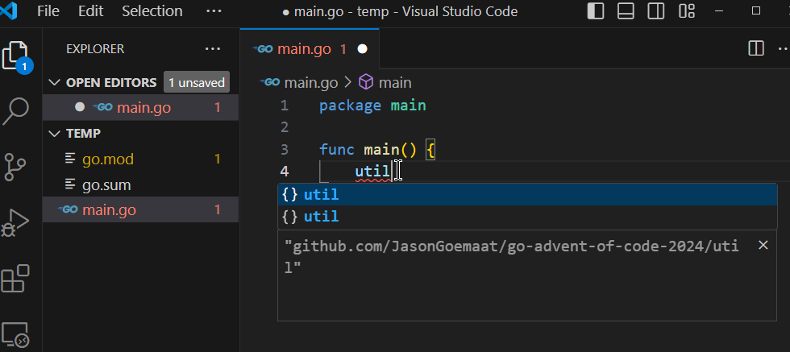

# Advent of Code 2024 in GO

Repo for my code figuring out the puzzles in [Advent of Code 2024](https://adventofcode.com/2024).

I thought this would be a good time to dive deeper into GO.
Using [cobra](https://github.com/spf13/cobra) and 
[cobra-cli](https://github.com/spf13/cobra-cli).

> NOTE: I refactored after day 5 and moved a lot of things around,
so there might be some discrepancies in the markdown files
for days 1-5.

Structure:

```
.
├─ /cmd
│  ├─ /dayXX
│  │  ├─ /data              // directory with data
│  │  │  ├─ input.txt       // main input file for testing solution
│  │  │  ├─ sample.txt      // sample data from instructions
│  │  ├─ dayXX.go           // cobra command for command line args and running
│  │  ├─ dayXX_solve.go     // code for solving the puzzles
|  │  ├─ dayXX_test.go      // tests, used to figure things out      
│  │  ├─ Instructions.md    // instructions copied from website
│  │  ├─ Work.md            // "showing my work" - thoughts while solving and learning go
│  ├─ root.go               // where commands and parameters are added
├─ /util                    // directory for utility functions
```

Running the solvers for day is done like this:

    go run . day01

Add the `-l` or `--log` option to see extra output if the solvers
are calling `util.MyLog()` for when I was testing something.   You
can add these to the solvers if you want to see what is going on
for some sample data.

Add the `--stdin` flag to read input from stdin.

Add the `-f <filename>` or `--file <filename>` arguments to read input from a file.

## Adding Commands

Using `cobra-cli`, we create a command for each day running commands like this:

    cobra-cli add day01

This creates a go file such as `cmd/day01.go`.  For my folder structure,
I create a new `cmd/day01` folder and move the file there, then update
the package to be `day01`.   I remove the `long` description and edit
the `short` description to the title of the day's puzzle.   I capitalize
the name (i.e. `day01Command` -> `Day01Command`) so it is public and
the root command can access it.   Then I remove the `init()` function
and instead edit `/cmd/root.go` to add the command in it's `init()`
function:

	rootCmd.AddCommand(day01.Day01Cmd)

A quick-fix when hovering on the squigglies under 'day01' will give the
option to import the package easily, or you can add it at the top by
the others:

	"github.com/JasonGoemaat/go-advent-of-code-2024/cmd/day01"

## Go Tips

Things that tripped me up or that are good to know and unusual

* Package names at the top of a file MUST match the directory name the file is in
    * The exception is `main` which goes in the root of the module
* functions and variables defined in a `.go` file are private to a package if lower-case and public if upper-case
    * Say you have a `.go` file with any name in the `cmd/day03` directory
        * If you name a function `oneSortToRuleThemAll`, it is private
            * it is available only to other `.go` files in the same package (which has to be the same as the directory name by convention)
        * If you name a function `OneSortToFindThem`, it is public
            * Other packages can import it with this:
                ```
                import "github.com/JasonGoemaat/go-advent-of-code-2024/cmd/day03"
                ```
* `import` syntax is to have one `import` and use parenthesis, then one package per line


## Go modules and packages

This really caused me a headache.  Module names must be url-like, without
the protocol, not sure how port would affect it.  When adding modules you
can use the full url, and so it's good to use a module name of the
actual location.   For example, I created this with:

    go mod init github.com/JasonGoemaat/go-advent-of-code-2024

Internal go library packages don't follow this convention though, for
example you can do:

    import "fmt"

To import the go 'fmt' package.  I'm not sure exactly what the rules are
for this.  I don't like not having aliases though, my imports have these
long package 'names' like in `cmd/root.go` to access packages in the same
module which seems very odd to me:

```go
import (
	"fmt"
	"os"

	"github.com/JasonGoemaat/go-advent-of-code-2024/cmd/day01"
	"github.com/JasonGoemaat/go-advent-of-code-2024/cmd/day02"
	"github.com/JasonGoemaat/go-advent-of-code-2024/cmd/day03"
	"github.com/JasonGoemaat/go-advent-of-code-2024/cmd/day04"
	"github.com/JasonGoemaat/go-advent-of-code-2024/cmd/day05"
	"github.com/JasonGoemaat/go-advent-of-code-2024/util"
	"github.com/spf13/cobra"
	"github.com/spf13/viper"
)
```

And if I want to change the package name for my module, I'd have to edit the
`go.mod` file and every import in the whole project.

The upside is that go actually fetches modules from source control and pins
them to a commit.  For example, you can create your own module in an empty
directory with this:

    go mod init example.com/test

Then import this module with `go get`:

    go get github.com/JasonGoemaat/go-advent-of-code-2024

Now if you create your `main.go` file (which will be in package `main`
because it's in the root of your module) and try to access the
`MyLog` function in my `util` package, vscode will come up with a suggestion
to import it from my package:



The other possibility for the 'util' package there is
`golang.org/x/tools/godoc/util` by the way.  

I tried to get this working with Azure Devops Server and never could.   It
required some git aliasing I think as go actually uses git.  Something to
do with authentication?  So you had to tell get a PAT and alias the url to
one using your PAT for authentication.  Couldn't get it to work.  Shame,
I think this would be a great way for developers to share their tools
and access internal private libraries.


